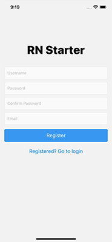
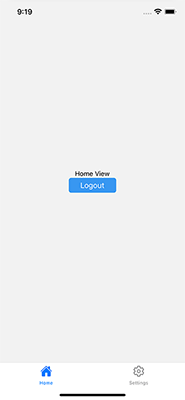

# React Native Starter
A useful starter template for [React Native](https://reactnative.dev/) projects. It 
takes care of some repetitive work that you need to do every time a new app is
started. Based on what I think are good practices, references below.

## What's in the project:
- Screens: Login, Register, Home and Settings.
- Authentication managed using createContext, useReducer and AsyncStorage.
- Custom components and ErrorHandler.
- ReactNavigation: AuthNavigator, TabNavigator and RootNavigator for manage
stacks separately.
  
## Project screens
| | 

| | 

## Start using the project
1- Clone the repository. 
2- In the project directory you can run:

##### `npx react-native run-ios`
##### `npx react-native run-android`

## Documentation and template references:
##### 1- [Login and Register](https://www.instamobile.io/app-templates/react-native-login-screen-template/) based on a free template from Instamobile.
##### 2- Docs and Articles:
* [React Native Authentication with Context API-Global State Management](https://medium.com/swlh/react-native-authentication-with-context-api-global-state-management-db8d3bf4e3f9).
* [How to structure a react-native project](https://elazizi.com/how-to-structure-a-react-native-project).

## Notes:
This project can grow by adding new functionalities that are repetitive in many of the cases that we create a new app. Any feedback will be appreciated.
